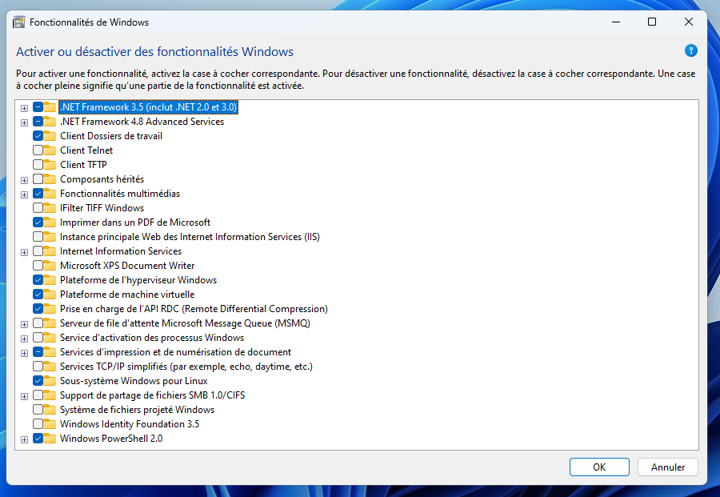

# Développement natif - Démonstration 1 : développer un programme *natif* en C, fiche de suivi

Dans cette démonstration, nous allons compiler du code source C vers un binaire executable par l'OS. Nous allons voir en détail les différentes étapes de la compilation.

- [Développement natif - Démonstration 1 : développer un programme *natif* en C, fiche de suivi](#développement-natif---démonstration-1--développer-un-programme-natif-en-c-fiche-de-suivi)
  - [Objectifs](#objectifs)
  - [Pré-requis](#pré-requis)
    - [Sous GNU/Linux (Debian, Ubuntu)](#sous-gnulinux-debian-ubuntu)
    - [Sous macOS](#sous-macos)
    - [Sous Windows](#sous-windows)
      - [WSL](#wsl)
      - [Erreurs rencontrées et configuration de Windows](#erreurs-rencontrées-et-configuration-de-windows)
  - [Compiler du code source C vers du langage machine (binaire)](#compiler-du-code-source-c-vers-du-langage-machine-binaire)
    - [Compilation](#compilation)
    - [Assemblage](#assemblage)
    - [Linkage](#linkage)
  - [Exécution et concept de librairie partagée](#exécution-et-concept-de-librairie-partagée)
  - [Bonus : scripter le processus de compilation avec `make`](#bonus--scripter-le-processus-de-compilation-avec-make)
  - [Conclusion de cette démo](#conclusion-de-cette-démo)

## Objectifs

- Comprendre le processus de compilation
- Comprendre que la compilation vise une plateforme spécifique

## Pré-requis

### Sous GNU/Linux (Debian, Ubuntu)

Installer le compilateur [gcc](https://fr.wikipedia.org/wiki/GNU_Compiler_Collection) (GNU Compiler Collection)

~~~bash
sudo apt install gcc
~~~

### Sous macOS

Installer gcc via [homebrew](https://formulae.brew.sh/formula/gcc).

### Sous Windows

#### WSL

Installer Windows Subsystem for Linux (WSL 2) pour accéder à un environnement GNU/Linux (Ubuntu par défaut) sur votre machine. La WSL est une machine virtuelle intégrée à l'environnement Windows permettant d'executer un noyau Linux et une distribution entière. Cette couche applicative *intégrée* à Windows vous permet donc d'accéder facilement à un écosystème GNU/Linux sur votre machine, sans avoir à installer ou configurer de machines virtuelles gourmandes en ressources, ou à installer un dual boot. 

La WSL 2 offre une interface vers un environnement GNU/Linux où l'utilisateur peut exécuter un shell Bash, ainsi que de célèbres programmes en ligne de commande GNU/Linux comme awk, sed, grep, etc.

Pour télécharger et installer WSL 2, vous pouvez vous rendre sur [la page officielle de Microsoft](https://learn.microsoft.com/fr-fr/windows/wsl/install) et suivre les instructions.

Ouvrez une Invite de commandes *en mode administrateur* en cliquant avec le bouton droit et en sélectionnant `"Exécuter en tant qu'administrateur"`

~~~bash
wsl --install
wsl --update
~~~

Le programme `wsl` active les fonctionnalités nécessaires pour exécuter la WSL, télécharge et installe le dernier noyau Linux, définit WSL 2 comme valeur par défaut et télécharge la distribution Ubuntu par défaut. Si WSL est déjà installé, le programme wsl vous l'indique et vous demande de choisir la distribution à servir, vous avez le choix entre plusieurs distributions GNU/Linux comme Ubuntu, Debian ou openSUSE. 

#### Erreurs rencontrées et configuration de Windows

**En cas de problèmes avec wsl**, veuillez [consulter cette page de problèmes connus](https://learn.microsoft.com/fr-fr/windows/wsl/troubleshooting) avant de demander de l'aide. Vous pouvez également consulter la FAQ pour en savoir plus.

 Pour exécuter WSL 2, vous devez au préalable *activer la plateforme de machine virtuelle Windows* (appelée Hyper-V). Si ce n'est pas le cas, vous allez obtenir un message comme celui-ci `"Please enable the virtual Machine Platform WIndows feature and ensure virtualization is enabled in the BIOS"`. 

 Pour activer la plateforme de virtualisation, redémarrer votre machine, appuyez sur `F2` ou la touche indiquée indiquée par votre carte-mère pour accéder au BIOS. Vous devez également vous assurer que les fonctionnalités Plateforme de l'hyperviseur Windows et Plateforme de machine virtuelle sont bien activées. Tapez `“fonctionnalités windows”` dans votre barre de recherche, puis activez-les. Redémarrez votre machine. 

Vérifier l'installation

~~~bash
systeminfo
~~~

La dernière entrée du rapport généré vous indiquera la configuration requise pour Hyper-V. Vérifier que tous les prérequis sont bien remplis.

Pour lister les distributions installées

~~~bash
wsl -l -v
~~~

Ouvrir la WSL. Choisissez un nom d'utilisateur et un mot de passe pour le système GNU/Linux. Cet utilisateur est l'administrateur du système avec la capacité d'exécuter des commandes d'administration (`sudo`). WSL va vous ouvrir shell sur votre instance GNU/Linux. Executer les commandes suivantes :

~~~bash
#Mettre à jour la liste des paquets
sudo apt update
#Mettre à jour les paquets
sudo apt upgrade
#Installer gcc
sudo apt install gcc
# Tester
gcc --version
~~~

Vous avez à présent accès à une distribution GNU/Linux via la WSL et installé le compilateur `gcc`.

## Compiler du code source C vers du langage machine (binaire)

**Créer un dossier** `demo-compilation`.

**Créer un fichier source** `main.c`.

~~~C
#include<stdio.h>

int main(){
    printf("Hello world !");
    return 0;
}
~~~

Ici on include le *header* `stdio.h` (`st`andard `i`nput/`o`utput). Un header fournit les définitions de fonctions, de variables et de structures de données sans fournir d'implémentation (à la manière des interfaces en POO). Cela permet d'utiliser la fonction `printf`, fournie par la librairie standard du C.

**Construire l'executable** à partir du code source pour la plateforme GNU/Linux en passant vers les différentes étapes de la "compilation" (*build*) :

1. **Compilation**
2. **Assemblage**
3. **Linkage** (Édition des liens)

> Regardez les différentes options de `gcc` avec l'option `--help`. Par défaut, `gcc` effectue toutes les étapes de la compilation en une fois. `gcc main.c` **compile**, **assemble** et **link** pour produire l'executable `a.out`

### Compilation

~~~bash
gcc -S main.c
~~~

Cela crée un fichier en langage assembleur `main.s`

> Inspecter le fichier assembleur avec `cat main.s`

Dans [l'assembleur](https://fr.wikipedia.org/wiki/Assembleur), il y a encore des références aux fonctions de la libraire standard.

### Assemblage

~~~bash
gcc -c main.s
~~~

Cela crée un fichier objet (executable au format ELF) `main.o`. Lors de la phase d'assemblage, le langage assembleur est transformé en binaire. Cela produit **un fichier objet** `.o`, qui contient du binaire mais également des références vers les fonctions de la libraire standard incluse (dépendances du code source `main.c`).

**Inspecter** le contenu du fichier `main.o` (`cat main.o`). Qu'est ce qui s'affiche ? Pourquoi ?

> Sous le capot, `gcc` utilise l'assembleur `as`

Le fichier *objet* **main.o** est un *artefact* qui n'**est pas encore exécutable**, car il doit accéder au binaire de la fonction `printf`

### Linkage 

<!-- 
Compilation Assemblage Linkage (CAS)
gcc -c: compilation et assemblage faits en une étape. gcc main.c ferait compilation, assemblage et linkage en une étape.
-c : Compile and assemble
-S : Compile seulement
-o <file>: Place the output file into <file>
 -->

**La phase d'édition des liens est la plus importante** à comprendre pour mieux comprendre comment Flutter est capable de *build* des executables natifs à chaque plateforme. 

À cette étape, le fichier objet `main.o` ne sait pas où trouver le code binaire de `printf`. La phase *d'édition des liens* (*linkage*) permet d'indiquer au compilateur **où** trouver le code binaire de la fonction `printf` sur la machine.

**Linker** pour créer le programme executable. *Link* vers l'implémentation (le binaire) de `printf`, fournit par la librairie standard :

~~~bash
gcc main.o -o say-hi
~~~

> L'option `-o` permet de contrôler le nom de fichier de sortie

> Sous le capot, `gcc` utilise le linker `ld`

## Exécution et concept de librairie partagée

**Executer** le binaire sur votre OS, via le shell :

~~~bash
./say-hi
~~~

Que se passe-t-il ? Le binaire `say-hi` est *exécuté*, c'est à dire le binaire de la fonction `main`. Un binaire est un code directement pris en charge par l'OS et exécuté sur son noyau (abstraction logicielle autour du matériel y compris le CPU), *sans autre intermédiaire logiciel*. 

Au moment de l'exécution, le système d'exploitation charge le programme binaire en mémoire. Comme `say-hi` dépend de *bibliothèque partagée* (*shared library*) `stdio`, via l'appel à `printf`, le chargeur dynamique (dynamic linker/loader) s'occupe de charger ces bibliothèques en mémoire (**si elles ne le sont pas déjà**) et de résoudre les adresses des fonctions externes, comme `printf`, pour que les appels à ces fonctions puissent être correctement dirigés vers leur code.  Lorsque `say-hi` appelle `printf`, l'exécution saute à l'adresse de la fonction `printf` chargée en mémoire, exécute son code binaire, puis revient à l'instruction suivante dans `say-hi` une fois que `printf` a terminé son exécution.

Une *shared library* est un code binaire chargé en mémoire qui peut être utilisé par plusieurs programmes en même temps. Cela permet notamment d'optimiser l'usage de la mémoire. Le binaire de `printf` est chargé en mémoire une fois, et peut être utilisé par de nombreux programmes en même temps. 

> Ce concept de *shared library* est abordé plus en détail de la deuxième démo.

Si on essaie d'exécuter le programme `say-hi` sur Windows, cela ne fonctionnera pas car l'executable généré est spécifique à l'OS GNU/Linux ([format ELF](https://fr.wikipedia.org/wiki/Executable_and_Linkable_Format)) ! Windows et Linux ne manipulent pas les mêmes formats de binaire. Également, lors de l'appel à `printf` (*dynamic linking*), il sera impossible de trouver (path) le binaire correspondant sur le système. `say-hi` est un programme *natif* à la plateforme GNU/Linux. Il a été *compilé pour cette plateforme* uniquement.

## Bonus : scripter le processus de compilation avec `make`

[`GNU make` est un programme qui permet de maintenir des programmes](https://www.gnu.org/software/make/). Il permet d'automatiser la compilation de programmes à partir des fichiers sources. `make` fonctionne sur la base de *règles* à écrire.

> L'utilité de make est mieux illustrée dans la démo 2 sur les shared libraries, où les sources et les dépendances sont plus nombreuses.

> Essayez `man make`. Naviguez.

<!-- 
Quand make est executé, il recherche dans le dossier courant un fichier Makefile ou makefile et execute la "cible"(target) par défaut. Une target est souvent un fichier (executable ou fichier objet) qui doit etre build.

On définit un ensemble de règles. Chaque règle a une TARGET, des prérequis et une suite de commande pour la construire.
 -->

**Créer** un fichier `Makefile`. Voici le template d'une règle `make` :

~~~Makefile
cible: dependance1 dependance2
    commande 1
    commande 2
~~~

où `dependance1` et `dependance2` sont d'autres cibles dont `cible` dépend. Ces règles seront donc exécutées par `make` en amont.

Pour executer une règle, dans le terminal :

~~~bash
make cible
~~~

Par défaut, `make` execute la première règle si aucune règle n'est spécifiée.

1. **Écrire** un `Makefile` qui permet de réaliser chaque étape du *build* (compilation, assemblage et linkage) *indépendamment*. Chaque règle doit pouvoir être exécutée directement. Par exemple, on doit pouvoir procéder au linkage sans *explicitement* passer par les phases de compilation et d'assemblage.

`make` permet de déclarer des variables sous forme de clef/valeur. Voici la syntaxe :

~~~Makefile
VARIABLE=VALEUR
~~~

Pour déférencer cette variable (extraire sa valeur) dans le `Makefile`

~~~Makefile
#Ceci est un commentaire
#Afficher sur la sortie standard le contenu de la variable VARIABLE
@echo $(VARIABLE)
~~~

2. **Déclarer** une variable qui contient le nom du binaire à produire (`say-hi`). **Mettre à jour** le `Makefile` en conséquence. On souhaite que l'instruction `make` fabrique le binaire `say-hi` et affiche à la fin `"Le programme say-hi a été compilé avec succès !"`

> Indice : pour afficher un message sur la sortie standard, utiliser la commande `@echo "Mon message"`.

3. **Écrire** une règle `clean` (règle standard) permettant de nettoyer tous les produits intermédiaires de la compilation.

## Conclusion de cette démo

- Ce qu'on appelle *compilation* de manière abusive comprend en fait plusieurs étapes : 
  - **Compilation** : transformation d'un code source dans un langage de haut niveau (C) en langage assembleur;
  - **Assemblage** : transformation de l'assembleur en fichier objet intermédiaire;
  - **Linkage** : création des liens entre le programme et le code binaire de ses dépendances sur la machine.
- Chaque OS (ou langage) fournit dans son SDK des libraires utilisables pour le développement (`stdlib.h` fait partie du SDK du langage C appelé *librairie standard* du C);
- Un *programme natif* est un programme compilé *vers une plateforme cible* (ici via `gcc`). Il est natif *à la plateforme* au sens où il a besoin d'accéder à du binaire présent sur la machine (shared library) et à un format spécifique à la plateforme. Ici, il est exécuté *directement* par l'OS (code machine ou binaire). 
- Il existe des outils comme `make` pour automatiser les processus liées à la compilation, notamment dans le cas de projets réels ou le nombre de fichiers sources et de libraires est important